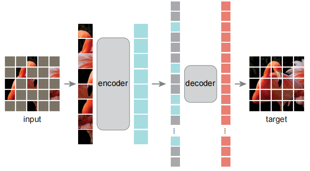
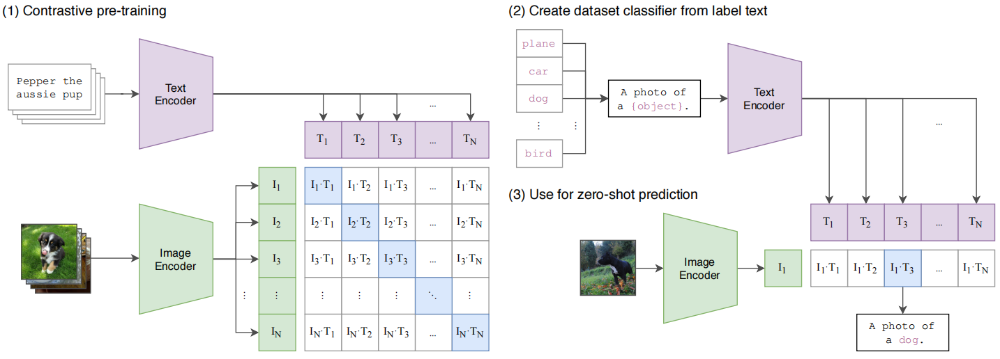
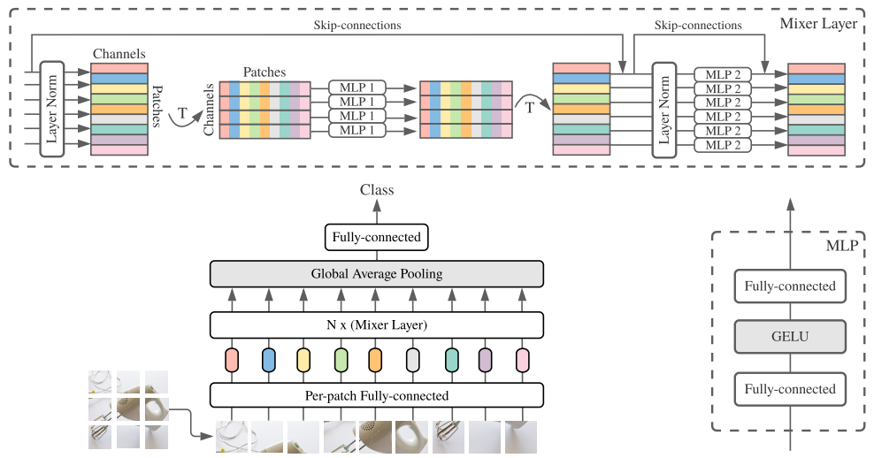
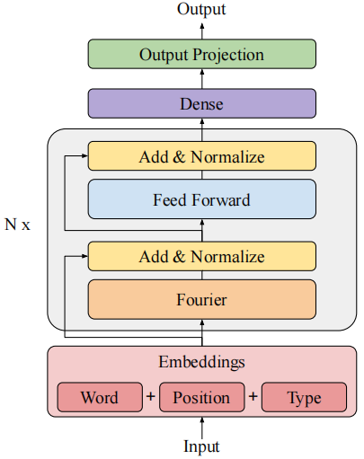

# Transformer系列经典论文笔记

## [Attention is All You Need](papers/attention%20is%20all%20you%20need.pdf)

\#**transformer**    \#**self-attention**    \#**machine translation**

- 提出了完全基于注意力机制的Transformer模型，相较RNN具有更高的computational efficiency和scalability，可以训练更大的模型

- 使用encoder-decoder架构（基于机器翻译任务）

- 使用multi-head attention，自注意力的输入和输出维度保持不变

- decoder使用masked attention

- 使用positional encoding
  
  ### 模型架构
  
  
  
  ### pytorch实现
  
  [github链接](https://github.com/wushidiguo/transformer)
  
  ---

## [BERT: Pre-training of Deep Bidirectional Transformers for Language Understanding](papers/BERT.pdf)

\#**BERT**    \#**mask**    #**self-supervised**    #**NLP**

- 使用transformer的encoder学习language representations

- 通过两个无监督学习任务进行预训练，Masked LM和Next Sentence Prediction (NSP)

- 所有输入都前置特殊字符[cls]，其对应的输出代表整个序列，用于分类任务

- 对下游任务，以预训练模型参数作为初始化，在有标签数据上对全部参数进行fine-tuning

- BERT<sub>BASE</sub> (L=12, H=768, A=12, Total Parameters=110M) and BERT<sub>LARGE</sub> (L=24, H=1024, A=16, Total Parameters=340M)

- 使用GeLU激活函数
  
  ### 模型架构
  
  
  
  ### pytorch实现
  
  [github链接](https://github.com/wushidiguo/BERT-pytorch)
  
  ---

## [An Image is Worth 16x16 Words: Transformers for Image Recognition at Scale](papers/ViT.pdf)

\#**ViT**    \#**CV**

- 使用标准的transformer encoder，ViT-B和ViT-L分别对应BERT<sub>BASE</sub>和BERT<sub>LARGE</sub>
  
  | Model     | Layers | Hidden size D | Heads | Params |
  | --------- |:------:|:-------------:| ----- |:------:|
  | ViT-Base  | 12     | 768           | 12    | 86M    |
  | ViT-Large | 24     | 1024          | 16    | 307M   |
  | ViT-Huge  | 32     | 1280          | 16    | 632M   |
  
  ViT-L/16指patch size为16 × 16的ViT-Large模型

- 将图像分割成固定大小的patches，每个patch拉直后经过线性embedding并加上位置编码，作为transformer的输入

- 采用learnable 1D位置编码，patch之间的空间关系通过学习得到

- fine-tuning时，采用0值初始化的D × K的前馈层代替预训练的分类头；在比预训练阶段更高分辨率的图像上进行微调效果更好，保持patch尺寸不变，增大序列长度，预训练得到的位置编码需要进行2D插值以适应此变化

- 相比于CNNs，transformer缺少相应的归纳偏置（translation equivariance and locality），在训练数据集较小的时候，表现不及CNNs；当在足够大数据集（14M-300M images）上进行预训练，再迁移到小数据集上时，表现优异

- 序列长度与patch size的平方成反比，patch size越小，计算越昂贵
  
  ### 模型架构
  
  
  
  ### pytorch实现
  
  [github链接](https://github.com/wushidiguo/vit-pytorch)
  
  ---

## [Masked Autoencoders Are Scalable Vision Learners](papers/MAE.pdf)

\#**MAE**    \#**CV**    \#**autoencoder**    \#**self-supervised**

- 使用非对称的encoder-decoder架构进行预训练，只有可见的patches会通过encoder，得到的latent representation和mask tokens一起作为decoder的输入，重建原图像；训练完成后，只有encoder用于下游任务的fine-tuning或linear-probing

- 相较于自然语言，图像有严重的信息冗余，使用较高的masking ratio（e.g.,75%)，可以迫使模型从整体理解图像内容，而且可以节省3×以上的训练时间和内存占用

- 损失函数为重建图像与原图像的均方误差（MSE），只计算masked patches的损失

- 使用轻量级的decoder，可以是单个block的transfomer

- mask token全局共享，通过学习得到

- 与对比学习不同的是，不使用数据增强，不会显著影响MAE的准确率。随机的masking在每次迭代中产生不同样本，降低了对数据增强的依赖

- 相较于ViT-L有监督学习，可以在较小的数据集上（ImageNet-1K）开展预训练，取得更好的泛化效果

### 模型架构



### pytorch实现

- [github链接](https://github.com/wushidiguo/vit-pytorch)

- 实现随机mask的部分代码：
  
  ```python
  rand_indices = torch.rand(batch, num_patches).argsort(dim = -1)
  masked_indices, unmasked_indices = rand_indices[:, :num_masked], rand_indices[:, num_masked:]
  # get the unmasked tokens to be encoded
  batch_range = torch.arange(batch)[:, None]
  tokens = tokens[batch_range, unmasked_indices]
  ```

---

## [Swin Transformer: Hierarchical Vision Transformer using Shifted Windows](papers/Swin.pdf)

\#**Swin**    \#**CV**    \#**backbone**

- 将transformer用作CV领域通用的backbone时，具有以下难点：
  
  1. 在NLP中，一个单词就是一个基本元素，而在CV领域，不同视觉元素的空间尺度可以相差很大，不同尺度的信息提取，对于物体检测等下游任务至关重要
  
  2. 一张图像中的像素数要远远超过一段文字当中的单词数，而自注意力的计算复杂度与图像尺寸的平方成正比，对于语义分割等需要像素级精度的任务，高分辨率图像计算代价难以承受（ViT）

- Swin将图像分割成大小为4×4的patch（通过卷积得到），为了产生具有层次结构的特征表达，采用batch merging层，将输入中2×2的邻接patch（特征维度为C）连接（特征维度4C），并通过一个线性层将特征维度降低到2C，同时分辨率降低为原来的1/2

- 相比ViT计算全局自注意力的方式，Swin采用平移窗口（包含M×M个patch，e.g.,M=7）方案，只在窗口内计算自注意力，计算复杂度与图像尺寸成正比；transformer block交替使用两种窗口划分的自注意力模块，一种是常规划分的W-MSA，另一种SW-MSA通过将常规窗口平移(⌊M/2⌋, ⌊M/2⌋)得到，自注意力可以使用cyclic-shifting和attention masking的方式计算
  
  

- 计算自注意力时，对每个head引入一个可学习的相对位置偏置矩阵$B∈R^{M^{2}\times M^{2}}$，可以提高模型准确率
  
  $$
  Attention(A,K,V)=SoftMax(QK^T/\sqrt{d}+B)V
  $$

- 使用DropPath而不是Dropout进行正则化

### 模型架构


### pytorch实现

- [github链接](https://github.com/wushidiguo/Swin-Transformer)

- SW-MSA生成mask的部分代码
  
  ```python
  img_mask = torch.zeros((1, H, W, 1))  # 1 H W 1
  h_slices = (slice(0, -self.window_size),
              slice(-self.window_size, -self.shift_size),
              slice(-self.shift_size, None))
  w_slices = (slice(0, -self.window_size),
              slice(-self.window_size, -self.shift_size),
              slice(-self.shift_size, None))
  cnt = 0
  for h in h_slices:
      for w in w_slices:
          img_mask[:, h, w, :] = cnt
          cnt += 1
  
  mask_windows = window_partition(img_mask, self.window_size)  # nW, window_size, window_size, 1
  mask_windows = mask_windows.view(-1, self.window_size * self.window_size)
  attn_mask = mask_windows.unsqueeze(1) - mask_windows.unsqueeze(2)
  attn_mask = attn_mask.masked_fill(attn_mask != 0, float(-100.0)).masked_fill(attn_mask == 0, float(0.0))
  ```

---

## [Learning Transferable Visual Models From Natural Language Supervision](papers/CLIP.pdf)

\#**CLIP**    \#**multi-modal**    \#**zero-shot**    \#**natural language supervison**

- 自然语言监督学习相比监督学习而言，不需要准确标注的数据，因而更容易增大规模

- 相比无监督或自监督方法而，自然语言监督学习不仅仅学习到一种特征表示，而且将这种表示与语言结合起来，从而实现灵活的zero-shot迁移学习

- 训练效率对大规模的自然语言监督学习至关重要。此前工作表明，对比学习任务比预测任务能够学习到更好的表示；图像生成模型虽然能够学习到更好的表示，但是比对比学习模型的计算量高出一个量级。CLIP采用类似对比学习的代理任务，对于一个有N个图像-文本对的batch（e.g.,N=32768），训练模型预测N×N个可能的配对中，哪些配对是正确的

- 采用对称的交叉熵损失函数，softmax函数中，控制logits（未归一化的概率）大小的温度参数τ，在训练过程中学习

- 在进行zero-shot图像分类时，分别通过图像和文本encoder获得图像和标签的特征表示，然后计算图像和各个标签的余弦相似度，继而计算一个softmax概率分布，标签的特征表示可以复用

- 使用类似“A photo of a {label}.”的模板处理标签，可以减少歧义的发生，从而提高准确率；通过将各种描述模板组合，可以进一步提高准确率；计算标签在不同模板下产生的特征表示，并缓存其均值进行复用，可以减少计算量

- 图像encoder使用resnet时，采用anti-aliasing strided convolution，用kernel_size=stride的avgpool和stride为1的卷积层取代原本stride>1的卷积层；最后的池化层没有采用avgpool，而是一个attentionpool

- 文本encoder使用了masked attention，[EOS]的输出作为整个文本的特征表示

### 模型架构



### pytorch实现

- [github链接](https://github.com/wushidiguo/CLIP)

- 伪代码
  
  ```python
  # image_encoder - ResNet or Vision Transformer
  # text_encoder - CBOW or Text Transformer
  # I[n, h, w, c] - minibatch of aligned images
  # T[n, l] - minibatch of aligned texts
  # W_i[d_i, d_e] - learned proj of image to embed
  # W_t[d_t, d_e] - learned proj of text to embed
  # t - learned temperature parameter
  # extract feature representations of each modality
  I_f = image_encoder(I) #[n, d_i]
  T_f = text_encoder(T) #[n, d_t]
  # joint multimodal embedding [n, d_e]
  I_e = l2_normalize(np.dot(I_f, W_i), axis=1)
  T_e = l2_normalize(np.dot(T_f, W_t), axis=1)
  # scaled pairwise cosine similarities [n, n]
  logits = np.dot(I_e, T_e.T) * np.exp(t)
  # symmetric loss function
  labels = np.arange(n)
  loss_i = cross_entropy_loss(logits, labels, axis=0)
  loss_t = cross_entropy_loss(logits, labels, axis=1)
  loss = (loss_i + loss_t)/2
  ```

---

## [MLP-Mixer: An all-MLP Architecture for Vision](papers/MLP-Mixer.pdf)

\#**MLP-Mixer**

- 不使用卷积操作和自注意力机制，只有MLP（多层感知机）
- 与ViT类似，将图像分割成patch，每个patch表示成一个向量
- MLP有两类，分别用于*channel-mixing*（相当于1×1的卷积，对应transformer中的FF）和*token-mixing*（对应于自注意力）
- 由于MLP本身就带有位置属性，所以Mixer不需要额外的位置编码

### 模型架构



### pytorch实现

- [github链接](https://github.com/wushidiguo/mlp-mixer-pytorch)

---

## [FNet: Mixing Tokens with Fourier Transforms](papers/FNet.pdf)

\#**FNet**  \#**Fourier Transform**

- 不使用自注意力层（计算复杂度为$O(N^2)$)
- 认为自注意力本质上是token之间信息的融合，可以用两个有参的矩阵乘法（类似Mixer，分别混合*sequence dimension*和*hidden dimension*）代替，甚至用无参的快速傅里叶变换（计算复杂度$O(N\log{N})$）进行token融合，也能取得接近的结果
- FNet用傅里叶层取代自注意力层，每个傅里叶层进行一次二维DFT（离散傅里叶变换，等效于分别在sequence dimension和hidden dimension进行一维DFT）：
  
  $$
  y=\mathfrak{R}(\mathcal{F}_{seq}(\mathcal{F}_h(x)))
  $$
- FNet在某些任务上准确度达到transformer的92%以上，训练速度比transformer快了80%，加入少量的自注意力层，能进一步提高准确率

### 模型架构



### pytorch实现

- [github链接](https://github.com/wushidiguo/FNet-pytorch)
